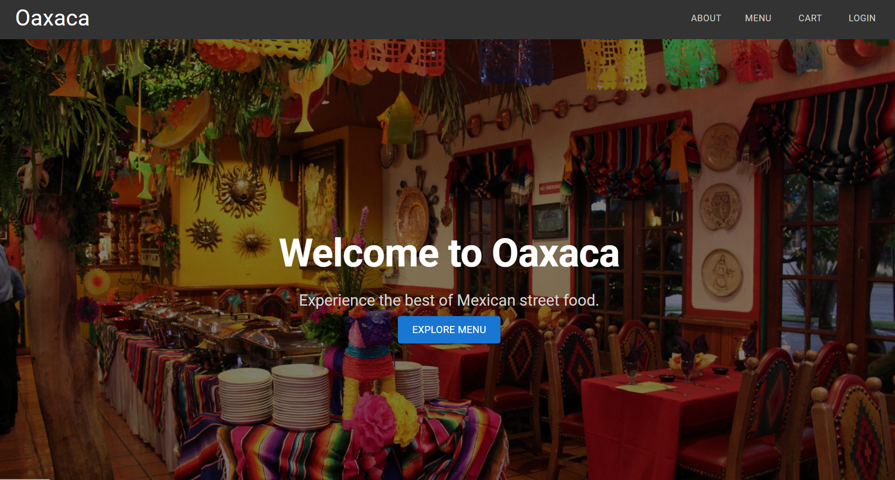

# Team Project

## Restaurant Application

### Description
This web application was developed as part of a group project for a restaurant. The main features include customer ordering system, manager functions, and communication between waiting and kitchen staff.

### Workflow of the Application
- Customers browse the menu, place orders, and submit them.
- Waiting staff sees the orders in real time.
- Kitchen staff receives the orders once waiters confirm them.
- The kitchen prepares the food and clicks **Ready** to notify waiters.
- Waiters deliver the food and click **Delivered** to update the system.

---

## Technology Choices

- **Front-end: React** – A JavaScript library for building responsive and interactive user interfaces. It was chosen for its component-based architecture, which enhances reusability and scalability.

- **Back-end: Java (Spring Boot)** – Spring Boot serves as the backbone of the application, handling business logic and data processing. Java was chosen for its strong Object-Oriented Programming (OOP) capabilities, while Spring Boot accelerates development with features like auto-configuration and dependency injection.

- **Database: H2 Database** – A lightweight, in-memory SQL database that provides fast and efficient data storage. It was chosen for its simplicity and seamless compatibility with Java applications.

---

## Features We Hope to Improve

- The Call Assistance button currently alerts all waiters with a sound effect but does not display specific notifications (e.g., *"Table X needs assistance"*). 
- The ability to stack notifications (currently, new notifications replace older ones instead of queuing them).
- The waiter's alert feature should display the time and date when an alert is sent.

---

## How to Install and Run the Project

### Prerequisites:
- Git
- Node.js

### Steps:

1. Open a terminal or command-line interface and clone the repository:
    ```sh
    git clone https://gitlab.cim.rhul.ac.uk/TeamProject05/TeamProject05.git
    ```
2. Navigate to the front-end directory:
    ```sh
    cd TeamProject05/Project/Frontend
    ```
3. Install dependencies:
    ```sh
    npm install
    ```
4. Start the front-end server:
    ```sh
    npm run dev
    ```
5. Open a new terminal and navigate to the back-end directory:
    ```sh
    cd TeamProject05/Project/Backend
    ```
6. Build the back-end application:
    ```sh
    mvn install 
    ```
7. Run the back-end application: 
    ```sh
    mvn spring-boot:run
    ```
8. Once both servers are running, open [http://localhost:5173](http://localhost:5173) in your web browser.

---

## How to Use the Project

### Customer's Perspective



- Visit http://localhost:5173 and navigate the Menu to add items to the Cart.

- Enter the name and table number (registration optional).

- Submit your order and track its status via the bottom drawer.

### Waiter's Perspective

- Log in to view and manage assigned table orders in real time.

- Confirm or cancel orders (cancellations notify customers, confirmations notify the kitchen).

- Deliver food when the kitchen marks it as ready.

- Edit the menu and request assistance from other waiters.

### Kitchen Staff's Perspective

- Log in to see confirmed orders with timestamps.

- Mark orders as Ready to notify waiters.

### Manager's Perspective

- Log in to view all outstanding orders and stock levels.

- Manage menu items, pricing, staff data, and reset business-day records.

---

## Credits

**Team Members:** Aditya Nair, Anesh Sugunakumar, Nathan Fernandes, Paing Thet Kyaw, Lahzee Limbu, Thomas Newman, Samuel Haddock, Salman Tariq
